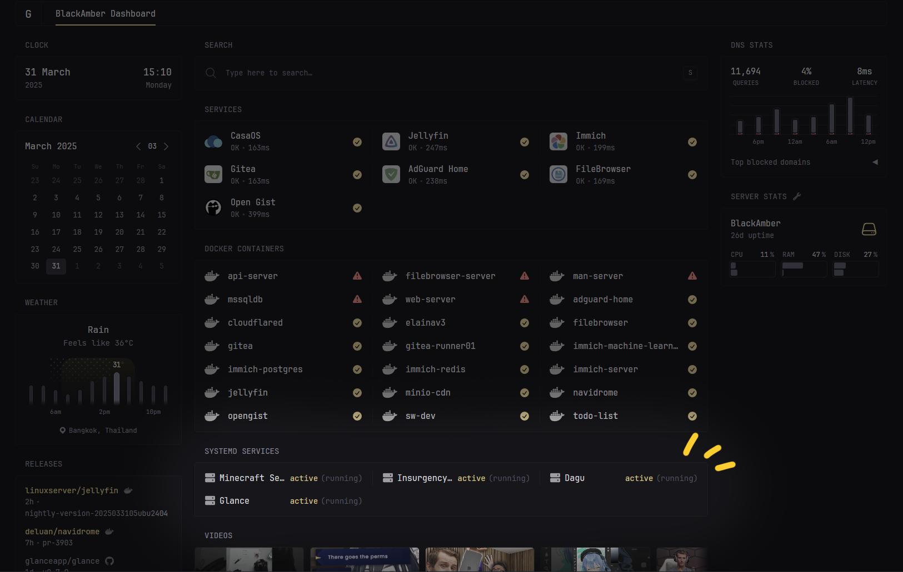
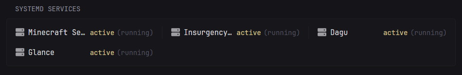

<h1 align="center">Systemd Glance ✨</h1>
<p align="center"><a href="https://github.com/glanceapp/glance/">Glance</a> extension for monitoring your Systemd services</p>





## Features
- ✅ **Monitor Systemd services**
- ✅ **View service status**: view ActiveState, SubState and description of your service
- ✅ **Fully customizable HTML templates** (real-time updates): customizable HTML templates for the widget

## Installation

To use Glance extension you'll need 2 things: **Basic API Server** and **Glance**. This project will be your API server that provides the necessary data to Glance.

You can find Glance configuration doc about Extension widget [here](https://github.com/glanceapp/glance/blob/main/docs/configuration.md#extension).

### Pre-requisites
- [Glance](https://github.com/glanceapp/glance/)
- [Node.js](https://nodejs.org/) (v18 or higher)
- [Bun](https://bun.sh/) (optional)

> [!NOTE]
> You can use either Node.js or Bun to run the server. If you have Bun installed, you can use it for better performance.
> **This guide will provide instructions for both. You just need to choose one.**

### 1. Server Setup

To setup the server, first clone or download the repository.

Then, navigate to the project directory and install the dependencies:

<details>
<summary><strong>For Bun</strong></summary>
<br>

```bash
bun install
```
</details>

<details>
<summary><strong>For Node.js</strong></summary>
<br>

```bash
npm install
```
</details>

Then you can run the server with the following command:

<details>
<summary><strong>For Bun</strong></summary>
<br>

```bash
bun run bun-start

# or with custom port
bun run bun-start -- --port 3000
```
</details>

<details>
<summary><strong>For Node.js</strong></summary>
<br>

```bash
npm run node-start

# or with custom port
npm run node-start -- --port 3000
```
</details>


### 2. Glance Setup

To setup Glance, you need to add the extension widget to your Glance configuration.
You can do this by adding `extension` widget to your `glance.yml` file. (or any `yaml` file for the page you want)

The example configuration is as follows:

```yaml
widgets:
  - type: extension
    url: http://localhost:8080 # default server port is 8080. if you changed it, use that port instead
    cache: 10s
    allow-potentially-dangerous-html: true # this is required for the HTML to be rendered
    parameters:
      # comma separated list of services to monitor ('.service' suffix is optional)
      services: sshd,docker,nginx
      # comma separated list of custom titles for the services (optional)
      servicesTitle: SSH Service,Docker Service,Cool Nginx
      # custom Widget title (optional)
      title: Systemd Services
```

After adding the configuration, you can reload the page to see the changes.

## Customization

You can customize the HTML template for the widget by modifying template files under `systemd-glance/public/templates`<sup><a href="./public/templates">jump</a></sup>.

### Template Syntax

The template uses a simple templating engine (that I definitely didn't write it from scratch 😅) that allows you to use variables, if-else and for-in loops to generate the HTML dynamically.

Here's a quick cheatsheet of the template syntax:

```html
<!-- variable interpolation -->
{{ $variableName }}
{{ $myCat.name }}

<!-- if condition -->
{{ if "sky" == "is blue" }}
<!-- Do something (never executes) -->
{{ endif }}

<!-- if-else condition -->
{{ if "sky" == "is blue" }}
<!-- Do something -->
{{ else }}
   <p>Sky is not blue 😉</p>
{{ endif }}

<!-- if-elseif-else confition -->
{{ if $myCat.weight > 10 }}
   <p>My cat is chonky.</p>
{{ elseif $myCat.weight < 1 && $myCat.age > 1 }}
   <p>Wait, is that even a cat?</p>
{{ else }}
   <p>My cat is a normal cute littel boi.</p>
{{ endif }}

<!-- for-in loop -->
<ul>
{{ for item in $shoppingList }}
   <li>- {{ $item }}</li>
{{ end }}
</ul>

<!-- for-in loop with list -->
<p>Let's count to 5:</p>
{{ for count in [1, 2, 3, 4, 5] }}
   <p>- {{ $count }}</p>
{{ end }}
```

> [!NOTE]
> **Here are something to note about the template syntax:**
> - Iterables for the for-in loops has to be a valid JSON array.
> - Conditions can be any valid JavaScript expression (this can be a security risk but I'm lazy) but all variables must be defined in the template.
> - All syntax is case-sensitive.
> - **You can't escape the template syntax**, yet. And no, putting it inside a comment doesn't work either. So be careful with your comments.


### Defined Variables

The following variables are defined in the template and can be used to generate the HTML dynamically.
***Those variables vary depending on the template file.***

#### `widget.html`

| Variable Name | Description | Data Type |
| -------------- | ----------- | ---------- |
| `$serviceElements` | List of compiled HTML elements in plain text | `string[]` |


#### `service.html`

| Variable Name | Description | Data Type |
| -------------- | ----------- | ---------- |
| `$service.activeState` | Active state of the service | `"active"`, `"inactive"`, `"failed"`, `"reloading"` |
| `$service.subState` | Sub state of the service | `"running"`, `"exited"`, `"dead"`, `"auto-restart"`, `"failed"` |
| `$service.description` | Description of the service | `string` |
| `$service.name` | Name of the service (e.g. `sshd`, `docker`) | `string` |
| `$service.title` | Custom title of the service | `string` |

